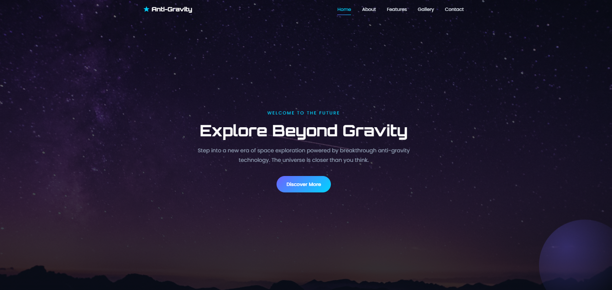
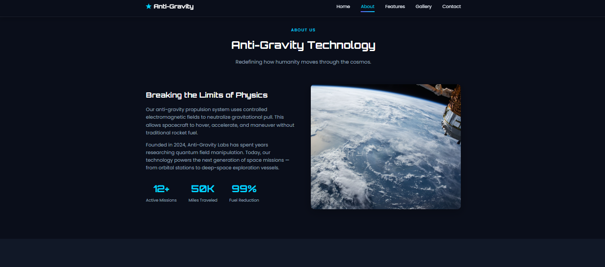
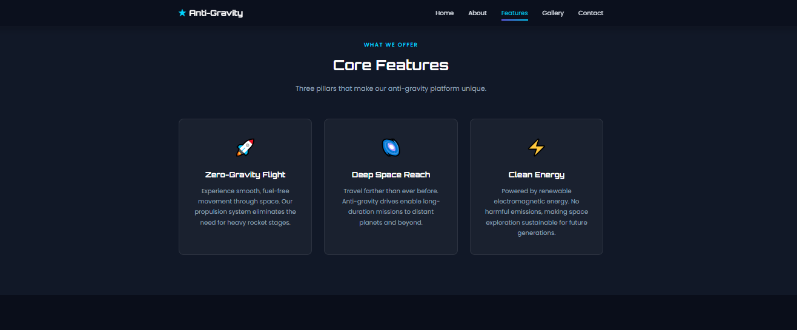
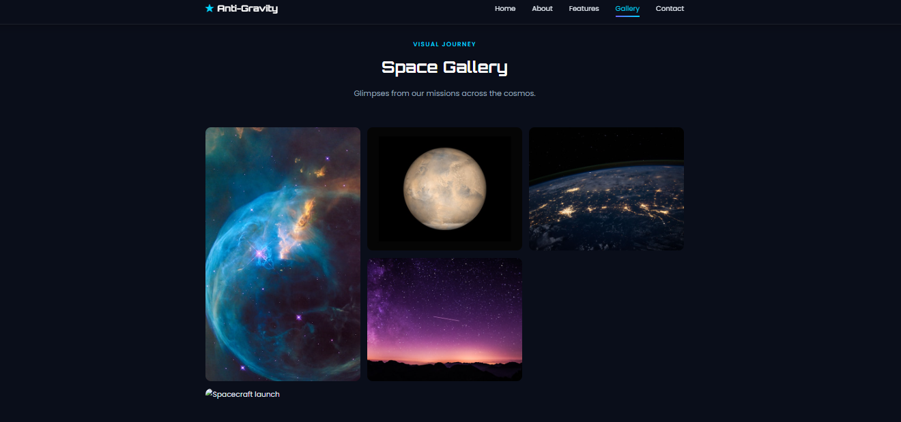
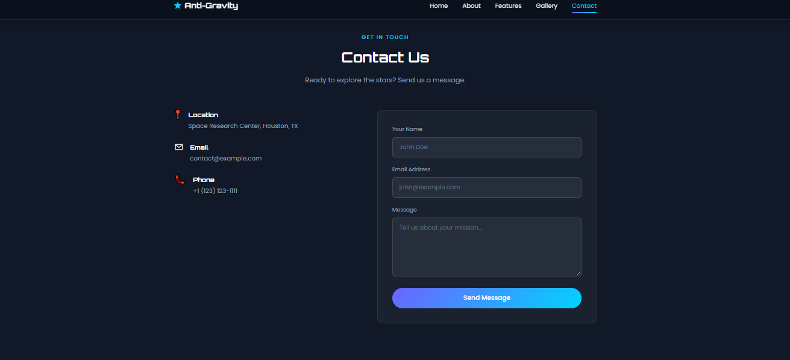

Create a complete professional README.md file for this project.

Project Name:
🚀 Anti-Gravity Landing Page

Requirements:

* Use proper GitHub Markdown formatting.
* Make the README modern, professional, recruiter-friendly, and suitable for a portfolio project.
* Include relevant emojis in section headings.
* Include the following sections:

# 🚀 Anti-Gravity Landing Page

## 📌 Project Overview

Explain that this is a modern responsive landing page built using HTML, CSS, and JavaScript with a futuristic anti-gravity and space exploration theme.

## ✨ Features

Include:

* Responsive design
* Fixed navigation menu
* Hover effects
* Dynamic navbar on scroll
* Smooth scrolling
* Hero section
* About section
* Features section
* Space gallery
* Contact section
* Mobile-friendly layout

## 🛠️ Technologies Used

* HTML5
* CSS3
* JavaScript

## 📸 Screenshots

### Home Page

### About Section

### Features Section

### Gallery Section

### Contact Section

## 📂 Project Structure

Show this structure:

project-folder/
│
├── images/
│   ├── home.png
│   ├── about.png
│   ├── features.png
│   ├── gallery.png
│   └── contact.png
│
├── index.html
├── style.css
├── script.js
└── README.md

## 🎯 Learning Outcomes

Include:

* Responsive web design
* Navigation menu interactions
* CSS transitions and animations
* UI/UX design principles
* JavaScript interactivity

## 🚀 How to Run

Explain how to clone/download the project and open index.html in a browser.

## 👨‍💻 Author

Mohammed Hamedullah Sajid

Created as part of a Web Development Internship project and enhanced as a standalone portfolio project.

## 📄 License

This project is intended for educational and portfolio purposes.

Generate the complete README.md content ready for direct use on GitHub.
